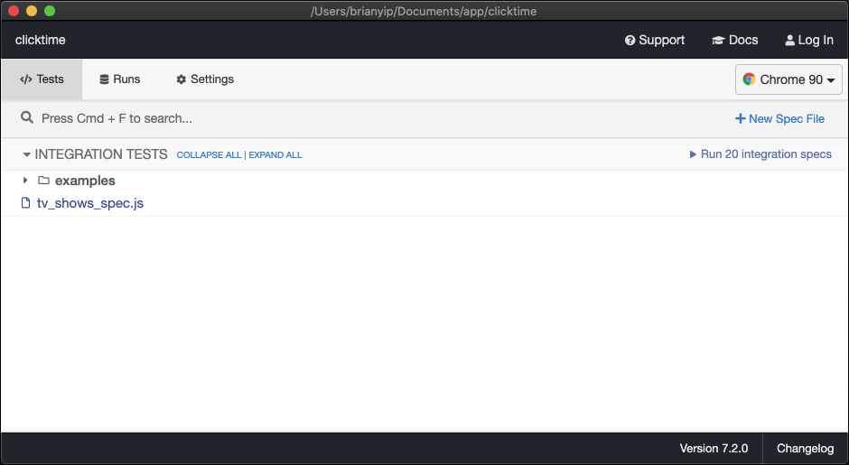

# Clicktime Wordgame tests

## Prerequisite
1.  install homebrew
  ```
  /usr/bin/ruby -e "$(curl -fsSL https://raw.githubusercontent.com/Homebrew/install/master/install)"

  brew update
  ```

2.  add homebrew to your `$Path`
  ```
  export PATH="/usr/local/bin:$PATH"
  ```

3.  install npm via node
  ```
  brew install node
  ```
4.  verify npm installed
  ```
  npm -v
  ```

### Run Tests
  1.  cd into `clicktime` test directory and run
    ```
    npx cypress open
    ```
  2.  click on tv_show_spec.js
    
